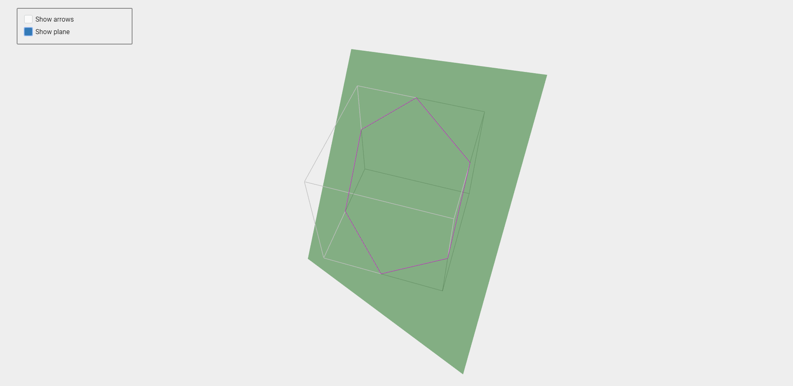

# proc3d
Different stuff on procedural generation of 3D models being put together

Drawing a wireframe cube with intersecting plane, finding an intersection cut and drawing it.

Demo: https://dmitrysieg.github.io/proc3d/src/main/resources/webapp/

